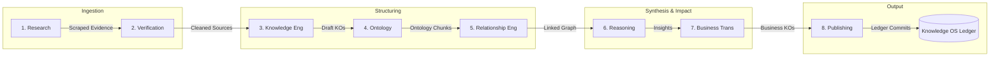

# System Architecture: The Knowledge OS & Research Factory

This document provides the technical blueprint for the Knowledge Operating System (KOS) and the permanent departments of the Research Factory. It establishes how raw inputs are continuously ingested, cited, structured, and queried by the intelligence layer.

---

## 1. The Three-Layer System Architecture

To ensure the system survives technology shifts and policy changes, we enforce a strict separation between permanent knowledge storage, disposable reasoning, and downstream consumer products.

```
+-------------------------------------------------------------------------------------------------+
|                                     LAYER 3: APPLICATIONS                                       |
|  [ SaralPrivacy ]  [ Custom Assessments ]  [ Discovery Engines ]  [ DSAR Portal ]  [ Dev APIs ]  |
+-------------------------------------------------------------------------------------------------+
                                                │
                                    (Consumes Layer 2 APIs)
                                                ▼
+-------------------------------------------------------------------------------------------------+
|                                    LAYER 2: REASONING LAYER                                     |
|    - Disposable AI agents query the Knowledge Infrastructure dynamically.                       |
|    - Questions answered: What changed? Why? Who is affected? What conflicts exist?               |
|    - Models do not memorize; they act as reasoning chips over structured graph contexts.         |
+-------------------------------------------------------------------------------------------------+
                                                │
                                    (GraphQL / Cypher / Vector)
                                                ▼
+-------------------------------------------------------------------------------------------------+
|                                LAYER 1: KNOWLEDGE INFRASTRUCTURE                                |
|    - The permanent core: "The Library of Alexandria". It only grows; nothing is mutated.         |
|    - Components: Knowledge Objects, Evidence Registry, Relationships, Git Ledger, Ontology.     |
+-------------------------------------------------------------------------------------------------+
```

### Layer 1: Knowledge Infrastructure (Permanent)
This layer acts as our immutable database of record. It has no intelligence of its own; it simply remembers forever. All entities, sources, citations, and version history are recorded as schema-compliant JSON files in the Git Ledger and indexed in a graph store.

### Layer 2: Reasoning (Disposable)
This is where the AI processing happens. We treat the LLM as a stateless reasoning chip. When a user asks a question, the reasoning engine queries the Knowledge Infrastructure, retrieves the relevant active subgraph, and reasons over it. If a new model version is released, we replace Layer 2—Layer 1 remains untouched. **We do not train models; we train the knowledge graph.**

### Layer 3: Applications (Consumer Products)
Downstream products (like SaralPrivacy or enterprise risk portals) consume Layer 2 API endpoints. They provide the interface and workflows for the final business users.

---

## 2. Open Core vs. Paid Reasoning Strategy

We grow a massive moat by keeping the foundational data open-source while charging for the intelligence layer:

| The Open Core (Infrastructure Commons) | The Paid Tier (Saral Intelligence) |
| :--- | :--- |
| • **Knowledge Objects:** All schema-validated files. | • **AI Reasoning Engine:** Custom workflow executors. |
| • **Ontology:** Our formal vocabulary structure. | • **Compliance Copilots:** Human-in-the-loop audit tools. |
| • **Sources & Citations:** Primary gazettes, cases, opinions. | • **Business Impact Engine:** Custom compliance alerts. |
| • **Knowledge Graph:** Nodes, edges, and history logs. | • **Automated Decisions:** API integrations and tools. |

---

## 3. The Research Factory: The Eight Departments

Instead of writing temporary execution scripts, we structure the AI processing layer as an organization of permanent departments. Each department operates as an autonomous agent service with specific inputs, outputs, and KPIs.



### Department Configurations and KPIs

#### 1. Research Department
* **Purpose:** Continuous discovery of new legal changes, cases, judgments, and expert advice (Layers 1-8).
* **KPIs:**
  * Source Coverage: 100% monitoring of gazettes, tribunal feeds, and key industry portals.
  * Freshness Latency: Ingestion within 4 hours of public release.
* **Output:** Cleaned text streams, PDFs, and scraped metadata signals.

#### 2. Verification Department
* **Purpose:** Remove noise, assess evidence confidence, and detect source contradictions.
* **KPIs:**
  * Correct Trust-Tier classification (Layers 1-8).
  * Cryptographic coordinate matching: 100% validation of chunk hashes.
* **Output:** Validated, scored evidence objects.

#### 3. Knowledge Engineering Department
* **Purpose:** Parse documents and convert text chunks into structured Knowledge Objects according to the JSON schema.
* **KPIs:**
  * Structural precision: 0% data loss during conversion from Markdown to KO files.
  * Schema conformity: 100% compliance with JSON-schema validators.
* **Output:** Draft Knowledge Objects.

#### 4. Ontology Department
* **Purpose:** Maintain system vocabulary and ensure all entities map cleanly to the 23 constitutional nouns. Never allow duplicate or unmapped concepts.
* **KPIs:**
  * Entity mapping accuracy > 99%.
  * Redundant node prevention = 100%.
* **Output:** Vocabulary-aligned Knowledge Objects.

#### 5. Relationship Engineering Department
* **Purpose:** Create links between objects using the 14 constitutional verbs. Ensure everything connects.
* **KPIs:**
  * Graph connection rate: Every KO must have at least one active edge.
  * Relation mapping precision > 98%.
* **Output:** Relational Graph updates.

#### 6. Reasoning Department
* **Purpose:** Evaluate the combined meaning of graph changes and detect conflicting opinions or splits. Generate semantic insights rather than simple summaries.
* **KPIs:**
  * Conflict detection rate = 100% (zero missed legal contradictions).
  * Argument soundness (evaluating trust scores of opposing paths).
* **Output:** Synthesized insights and conflict reports.

#### 7. Business Translation Department
* **Purpose:** Convert complex legal language into concrete business actions ("What changes for businesses? Which controls must update?").
* **KPIs:**
  * Actionability score: High-quality compliance instructions mapped to business roles.
  * Control linkage precision: Accurate mapping to templates and SOP checksheets.
* **Output:** Business Impact and Recommendation annotations on KOs.

#### 8. Publishing Department
* **Purpose:** Commit validated transactions to the Git Ledger, update search indices, refresh graph databases, and trigger webhook alerts to consumer applications.
* **KPIs:**
  * Transaction commit rate = 100%.
  * Downstream notification latency < 10 seconds.
* **Output:** Signed Git commit tags and active Graph database updates.

---

## 4. The Daily Cycle

Every single day, the departments run in a perpetual, coordinated loop:

```
                  [ Morning Wakes Up ]
                           │
                           ▼
                  [ Research Dept ] ─────────> "What is new?" (Inspect feeds)
                           │
                           ▼
                 [ Verification Dept ] ──────> "What is this?" (Validate evidence)
                           │
                           ▼
                [ Knowledge Eng & Ont ] ─────> "Where does it fit?" (Structure KO)
                           │
                           ▼
                [ Relationship Eng ] ────────> "What connects?" (Map graph edges)
                           │
                           ▼
                [ Reasoning & Translation ] ──> "What changes?" (Assess impact)
                           │
                           ▼
                 [ Publishing Dept ] ────────> "Who should know?" (Deploy & Alert)
```

This cycle continues forever.
